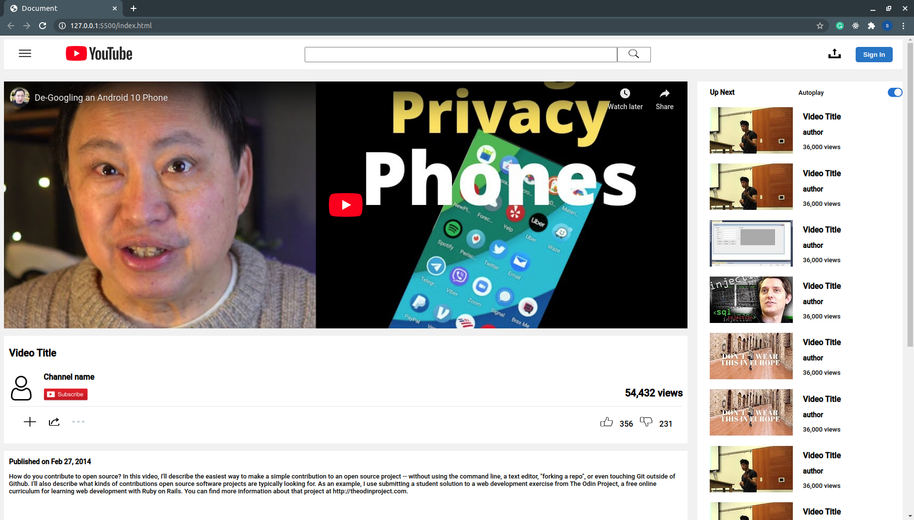

# Project Name: YouTube-s-video-player-page

> In this project we strived to create a youtube video player page clone that was responsive and aesthetically pleasing. We used HTML & CSS3(Flexbox) to achieve this.

A Youtube clone project

## Built With

- HTML & CSS3,
- NO frameworks,
- Vscode

## Getting Started

To get a local copy up and running follow these simple example steps.

### Prerequisites: 
    Code Editor

### Setup : 
    '$git clone https://github.com/jurgen1c/YouTube-s-video-player-page-/tree/master'

### Install: 
    Run local server

### Usage: 
    Youtube clone for personal projects

## Authors

👤 **Jurgen**

- Github: [@jurgen1c](https://github.com/jurgen1c) 
- Linkedin: [linkedin](https://www.linkedin.com/in/jurgen-clausen-2740061a9/ )

👤 **Sanad**

- Github: [@sanadwj](https://github.com/sanadwj)
- Linkedin: [linkedin](https://www.linkedin.com/in/sanad-abu-jubara-51516548/)

## 🤝 Contributing

Contributions, issues and feature requests are welcome!

Feel free to check the [issues page](issues/).

## Show your support

Give a ⭐️ if you like this project!

